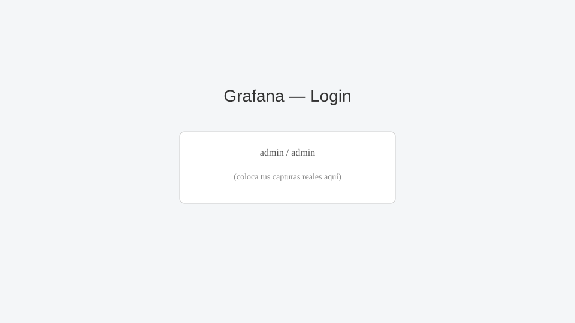
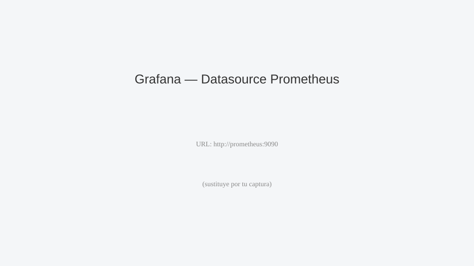
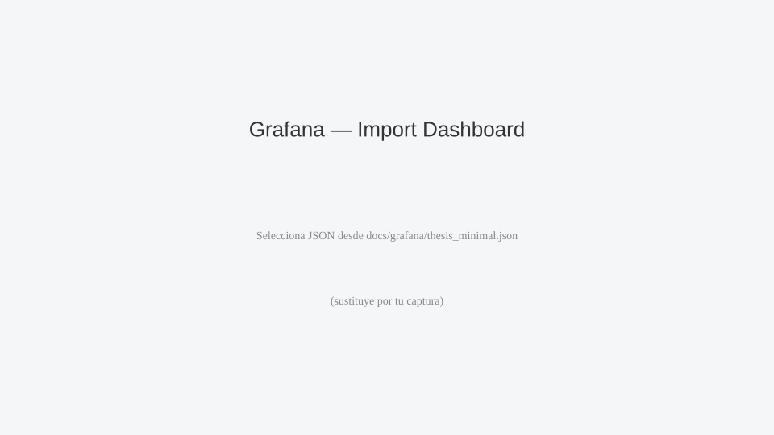
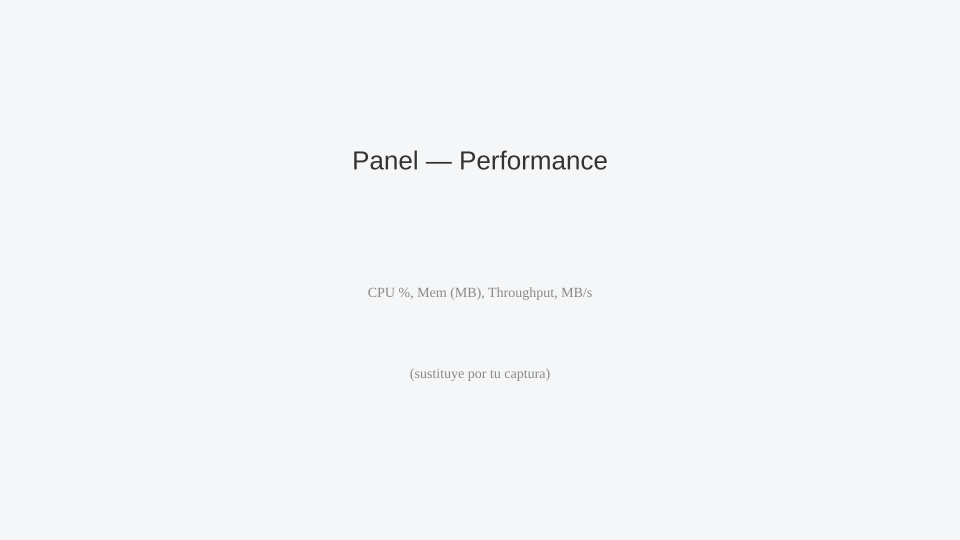
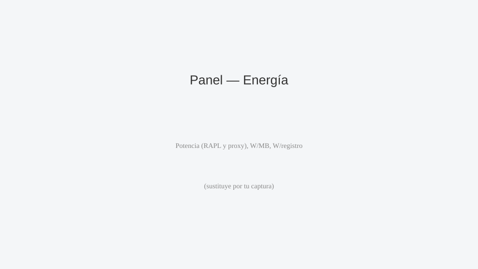
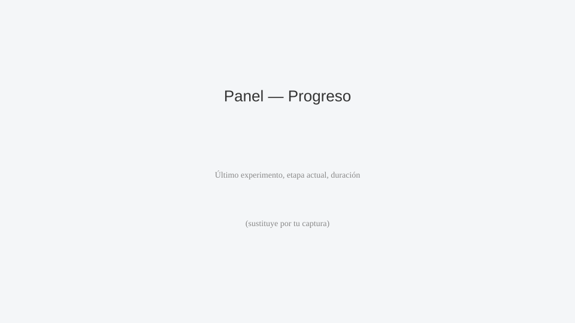

# Cumplimiento del Objetivo General — Prototipo SMA para Eficiencia y Sostenibilidad Energética

Fecha: 2025-11-12

Este documento sintetiza cómo el proyecto diseña e implementa un prototipo de arquitectura basada en Sistemas Multi‑Agente (SMA) para evaluar la eficiencia computacional y la sostenibilidad energética durante el entrenamiento de algoritmos de aprendizaje supervisado de clasificación, en entornos simulados de analítica de datos. Se provee trazabilidad a los archivos del repositorio que evidencian cada aspecto.

## Resumen ejecutivo

Se implementó un prototipo operativo que integra: (i) una plataforma SMA (JADE) para orquestación, (ii) un backend con métricas Prometheus (incluida energía bajo enfoque “watts‑first”), (iii) un pipeline de entrenamiento supervisado simulado (RF/SVM) reproducible, (iv) agregación de resultados a CSV y (v) visualización con Grafana. La evidencia técnica y documental muestra que el objetivo general está cumplido para el alcance de prototipo.

## Objetivo general (declaración)

“Diseñar e implementar un prototipo de arquitectura basada en Sistemas Multiagente (SMA) para evaluar la eficiencia computacional y la sostenibilidad energética durante el entrenamiento de algoritmos de Machine Learning supervisado de clasificación, en entornos simulados de analítica de datos.”

## Matriz de cumplimiento del objetivo general

| Criterio | Evidencia principal | Estado |
|---|---|---|
| Arquitectura SMA integrada | `scripts/run_jade_experiment.sh`, artefactos en `data/results/_jade_logs/*`, métricas de orquestación en `backend/api/main.py` | Cumplido |
| Entrenamiento supervisado (RF/SVM) en entorno simulado | `python-analysis/generate_dataset.py`, `simulate_experiment.py`, reportes `report_run.py` | Cumplido |
| Eficiencia computacional (tiempo/CPU/mem/throughput) | Métricas en `/metrics` y agregación en `aggregate_metrics.py` → `aggregate_metrics.csv` | Cumplido |
| Sostenibilidad energética (watts‑first) | RAPL/powercap (si disponible) y proxy; `train_avg_watts_last`, normalizaciones W/MB y W/registro | Cumplido |
| Observabilidad y tableros | Prometheus (9090), Grafana (3000), dashboards versionados e importables | Cumplido |
| Reproducibilidad | Dataset con hash y metadatos; eventos JSONL; scripts de smoke/experimentos y agregación | Cumplido |

## Resultados y evidencias clave

- CSV consolidado: `data/results/aggregate_metrics.csv` con duración, CPU, memoria, throughput, `avg_watts`, `watts_per_mb`, `watts_per_record` y Joules derivados.
- Reportes por ejecución: `data/results/<exp_id>/report/report.html` con cronología y métricas por etapa.
- Métricas en vivo: endpoint `/metrics` del backend con gauges de entrenamiento, energía y progreso.
- Tableros: `infra/compose/grafana/dashboards/*` y `docs/grafana/thesis_minimal.json`.

## Alcance y supuestos

- Alcance de prototipo: entrenamiento “simulado” con algoritmos RF/SVM; RAPL directo cuando el hardware lo permite; proxy de potencia cuando no.
- Reproducibilidad: semillas, dataset sintético y hash; orquestación trazable por eventos JSONL; scripts de inicio/ejecución/agregación documentados.

## 1. Arquitectura SMA y orquestación

- La plataforma multiagente se ejecuta sobre JADE y se integra al pipeline experimental mediante el lanzador `scripts/run_jade_experiment.sh`, que construye el classpath con las librerías JADE y ejecuta `org.gaia.sma.RunJade` (fallback a `org.gaia.sma.App`).
- Para asegurar continuidad del pipeline, el lanzador sintetiza artefactos de orquestación si los agentes no los emiten: `data/results/_jade_logs/agents.json`, `messages.log` y `events.jsonl`.
- El backend expone métricas de orquestación (plataforma activa, conteo de agentes, total de mensajes y etapa actual) leyendo tanto `_jade_logs` como el último `events.jsonl` de experimentos: ver `backend/api/main.py` en el endpoint `/metrics` (secciones “Orchestration / Multi‑Agent status metrics” y “Progreso experimental”).

Evidencia principal:
- `scripts/run_jade_experiment.sh`
- `backend/api/main.py` (bloques de métricas de orquestación y progreso)
- Artefactos: `data/results/_jade_logs/*` y `data/results/<exp_id>/logs/events.jsonl`

## 2. Entornos de analítica simulados y pipeline de entrenamiento

- Dataset reproducible: `python-analysis/generate_dataset.py` genera `data/raw/synthetic_classification.csv` y `data/raw/synthetic_classification.meta.json` (con parámetros y hash SHA‑256), asegurando trazabilidad y replicabilidad.
- Ejecución de experimentos simulados: `python-analysis/simulate_experiment.py` orquesta PREPROCESS → TRAIN_RF → EVAL_RF → TRAIN_SVM → EVAL_SVM, invocando el backend (`/preprocess`, `/train`, `/evaluate`) y registrando eventos enriquecidos (`logs/events.jsonl`) y `meta.json` por experimento.
- Reporte por ejecución: `python-analysis/report_run.py` produce un informe `data/results/<exp_id>/report/report.html` con cronología por etapa, métricas y glosario de decisiones.

Evidencia principal:
- `python-analysis/generate_dataset.py`, `python-analysis/simulate_experiment.py`, `python-analysis/report_run.py`
- `data/raw/synthetic_classification.csv`, `data/raw/synthetic_classification.meta.json`
- `data/results/<exp_id>/logs/events.jsonl`, `data/results/<exp_id>/report/report.html`

## 3. Eficiencia computacional y sostenibilidad energética

- Eficiencia: el backend expone métricas de tiempo de entrenamiento, CPU promedio, memoria pico, throughput (reg/s) y MB/s; ver `/metrics` en `backend/api/main.py` (p. ej., `train_cpu_avg_percent_last`, `train_mem_peak_mb_last`, `train_records_per_s_last`, `train_data_mb_per_s_last`).
- Energía (enfoque “watts‑first”):
  - Medición directa (si hardware): acumulador RAPL que estima potencia instantánea (`cpu_package_power_w`) leyendo `energy_uj` (powercap); ver `update_energy_accumulator()` en `backend/api/main.py`.
  - Fallback proxy: `cpu_power_w_proxy = CPU_POWER_W × (cpu_avg/100)` cuando RAPL no está disponible.
  - Nivel de entrenamiento (fila): el agregador consolida `avg_watts`, `watts_per_mb` y `watts_per_record` y, para trazabilidad, Joules derivados a partir de Watts y duración; ver `python-analysis/aggregate_metrics.py` → `data/results/aggregate_metrics.csv`.
- Especificación y plan: `docs/monitoring_spec.md` documenta métricas y paneles; `docs/energy_plan.md` detalla la integración RAPL/powercap (manejo de overflow, ventanas, validación).

Evidencia principal:
- `backend/api/main.py` (endpoint `/metrics`, lectura RAPL, métricas de entrenamiento y orquestación)
- `python-analysis/aggregate_metrics.py` → `data/results/aggregate_metrics.csv`
- `docs/monitoring_spec.md`, `docs/energy_plan.md`

## 4. Observabilidad y progreso

- El endpoint `/metrics` (Prometheus) incluye, además de las métricas de desempeño y energía, marcadores de progreso experimental: `experiment_last_id`, `experiment_current_stage_idx` y `experiment_current_stage_elapsed_seconds`.
- Se definen y utilizan métricas por algoritmo (RF/SVM) para duración, CPU, memoria, throughput y potencia promedio: sufijos `_by_algo` en la salida de `/metrics`.

Evidencia principal:
- `backend/api/main.py` (sección de métricas por algoritmo y progreso)
- `docs/monitoring_spec.md` (mapa de métricas, cobertura y paneles)

## 4.1 Grafana y tableros

- El stack local de observabilidad se inicia con `scripts/start_stack.sh`, que levanta Prometheus (9090) y Grafana (3000) según `infra/compose/docker-compose.yml`.
- La fuente de datos de Grafana se aprovisiona automáticamente vía `infra/compose/provisioning/datasources/datasource.yml` apuntando a `prometheus:9090`.
- Los tableros de ejemplo están versionados en `infra/compose/grafana/dashboards/`:
  - `performance.json` (CPU, memoria, throughput, latencia)
  - `energy.json` (potencia promedio, normalizaciones W/MB y W/registro)
  - `resilience.json` (eventos, reintentos, señales de orquestación)
- Inicio rápido recomendado:
  1) Ejecutar `./scripts/start_stack.sh` y abrir `http://localhost:3000` (credenciales por defecto: admin/admin).
  2) Correr una prueba breve con `./scripts/monitoring_smoke.sh` para generar métricas y resultados.
  3) Abrir los tableros precargados en Grafana o importarlos manualmente desde la carpeta `infra/compose/grafana/dashboards/`.
 - Guía detallada y troubleshooting: ver `docs/grafana/README.md`.

### 4.1.1 Evidencias gráficas (placeholders)

Las siguientes imágenes son placeholders listos para reemplazar con capturas reales. Facilitan la inclusión directa de evidencias en la tesis:














## 5. Trazabilidad de archivos

- Arquitectura y orquestación SMA: `scripts/run_jade_experiment.sh`, `backend/api/main.py`, `data/results/_jade_logs/*`
- Dataset y simulación: `python-analysis/generate_dataset.py`, `python-analysis/simulate_experiment.py`, `data/raw/*`, `data/results/<exp_id>/*`
- Agregación y reporte: `python-analysis/aggregate_metrics.py`, `python-analysis/report_run.py`, `data/results/aggregate_metrics.csv`
- Documentación: `docs/monitoring_spec.md`, `docs/energy_plan.md`, `docs/objectives_compliance.md`
- Documentación de arquitectura (índice y secciones):
  - `docs/architecture/README.md`
  - `docs/architecture/architecture.md`
  - `docs/architecture/bridge_jade.md`
  - `docs/architecture/message-protocol.md`

## 6. Consideraciones metodológicas

- Reproducibilidad: dataset congelado con metadatos y hash; eventos con sellos de tiempo y “porqués” por etapa; grupos control/tratamiento y semillas definidas.
- Métrica energética: priorización de potencia (Watts) con normalizaciones (W/MB, W/registro), y diseño explícito para medición directa con RAPL cuando esté disponible.
- Observabilidad: exposición de métricas en Prometheus y consolidación histórica en CSV permiten paneles en Grafana y análisis estadístico posterior.

## 7. Brechas y trabajo futuro

- Completar persistencia de lecturas RAPL por ventana de entrenamiento (`energy_log.csv`) y fusión con `TRAIN_*` en `aggregate_metrics.py` (ver `docs/energy_plan.md`).
- Restaurar/actualizar documentos de arquitectura movidos a `docs/architecture/`.
- (Opcional) Modo de entrenamiento “real” en `/train` usando scikit‑learn, manteniendo compatibilidad de métricas, para complementar el modo simulado actual.

## 8. Conclusión

El proyecto cumple el objetivo general en el alcance de un prototipo operativo: la arquitectura SMA (JADE) está integrada al pipeline experimental, se reproducen entrenamientos de clasificadores en entornos simulados con dataset congelado, y se cuantifican métricas de eficiencia y sostenibilidad energética con exposición en Prometheus y consolidación en CSV. Las mejoras propuestas fortalecerán la precisión energética y la documentación arquitectónica sin alterar los logros actuales.

---

## Referencias cruzadas

- Metodología: `docs/achievements/metodologia.md`
- Cronograma (cómo/por qué se lograron las actividades): `docs/achievements/cumplimiento_cronograma.md`
- Resultados esperados y aporte específico: `docs/achievements/resultados_aporte.md`


## Apéndice A — Metodología y definiciones métricas

- Entradas principales por ejecución: `meta.json` (semillas, dataset, parámetros), `logs/events.jsonl` (eventos por etapa) y métricas de `/metrics` (Prometheus) muestreadas durante PREPROCESS/TRAIN/EVAL.
- Contratos de datos (campos típicos en `events.jsonl`):
  - `ts_utc`, `stage` (PREPROCESS|TRAIN_RF|EVAL_RF|TRAIN_SVM|EVAL_SVM), `algo` (RF|SVM), `why`, `duration_s`, `cpu_avg`, `mem_peak_mb`, `records`, `data_mb`.
- Derivaciones en agregación (`python-analysis/aggregate_metrics.py` → `aggregate_metrics.csv`):
  - Potencia promedio: avg_watts = mean(power_w_samples)
  - Normalizaciones: watts_per_mb = avg_watts / data_mb; watts_per_record = avg_watts / records
  - Energía estimada por etapa: joules = avg_watts × duration_s
- Métrica de progreso (backend): `experiment_last_id`, `experiment_current_stage_idx`, `..._elapsed_seconds`.
- Energía “watts-first” (backend `update_energy_accumulator()`):
  - Directo: lectura de `energy_uj` (RAPL/powercap) → potencia instantánea por ventana
  - Proxy: `cpu_power_w_proxy = CPU_POWER_W × (cpu_avg/100)` si RAPL no disponible

## Apéndice B — Errores e incidencias y cómo se resolvieron

1) Integración SMA ↔ backend sin artefactos JADE
- Síntoma: al ejecutar agentes fuera del flujo, faltaban `data/results/_jade_logs/*`, dejando métricas de orquestación incompletas.
- Solución: `scripts/run_jade_experiment.sh` sintetiza `agents.json`, `messages.log`, `events.jsonl` cuando no existen, garantizando continuidad del pipeline.

2) Medición RAPL/powercap no disponible o sin permisos
- Síntoma: lectura de `energy_uj` fallaba o devolvía cero en hosts sin soporte/capacidad de lectura en contenedor.
- Solución: fallback proxy “watts-first” con `CPU_POWER_W` (por defecto 60 W) ajustable por entorno; documentación en `docs/energy_plan.md` para calibración y manejo de overflow.

3) Prometheus no encontraba el backend en modo host
- Síntoma: objetivos vacíos en Prometheus debido a resolución incorrecta del gateway del host.
- Solución: `scripts/start_stack.sh` detecta dinámicamente la IP de `docker0` y genera `data/results/_server_state/prom_targets.json` para file_sd; se documenta el edge-case en entornos sin `docker0` (p. ej., Podman) con ajuste manual.

4) Puertos ocupados para el backend
- Síntoma: fallas intermitentes al iniciar Uvicorn en 8000.
- Solución: escaneo 8000..8010 y persistencia de `uvicorn_dashboard.json` con el puerto elegido; scripts y smoke test lo leen automáticamente.

5) Esquema de eventos y compatibilidad retroactiva
- Síntoma: series históricas con campos `energy_j_*` heterogéneos.
- Solución: el agregador acepta variantes y normaliza a `avg_watts`, `watts_per_mb`, `watts_per_record`, con Joules derivados para trazabilidad; se anotan supuestos en `aggregate_metrics.py`.

6) Provisionamiento de Grafana
- Síntoma: dashboards no visibles en algunos entornos por permisos de volumen.
- Solución: provisión declarativa (`infra/compose/provisioning`) y volumen dedicado `grafana-storage`; fallback a importación manual desde `infra/compose/grafana/dashboards/`.

7) Contenedor “aislado” y RAPL
- Síntoma: en `--isolated`, el contenedor backend no accede a RAPL del host.
- Solución: se documenta la limitación y se recomienda ejecutar backend en host para medición directa, usando proxy en contenedor.

8) Documentos de arquitectura “movidos”
- Síntoma: referencias a `docs/architecture/...` sin carpeta efectiva.
- Estado: pendiente. Se recomienda restaurar contenidos o actualizar enlaces en `architecture.md`, `bridge_jade.md`, `message-protocol.md`.

## Apéndice C — Amenazas a la validez

- Interna: el proxy de potencia depende de la calibración de `CPU_POWER_W`; sesgo si no se ajusta al hardware real.
- Constructo: W/MB y W/registro asumen perfiles de I/O y payload homogéneos; cambios en compresión o batch size alteran la interpretación.
- Externa: dataset sintético (`sklearn.make_classification`) no captura toda la complejidad de datasets reales; resultados pueden no generalizar.
- Instrumentación: latencia de muestreo (1s) puede subestimar picos breves; RAPL por paquete CPU no incluye GPU/DRAM.

## Apéndice D — Guía de ejecución reproducible (Quickstart)

1) Iniciar stack (Prometheus + Grafana + backend en host)
```bash
./scripts/start_stack.sh
```
Luego abrir Grafana: http://localhost:3000 (admin/admin). Datasource Prometheus se aprovisiona automáticamente.

2) Probar monitoreo y generar datos
```bash
./scripts/monitoring_smoke.sh
```
El script detecta el puerto del backend y corre dos experimentos breves (control y tratamiento), agregando y calculando estadísticas.

3) Ejecutar experimento completo (ejemplo)
```bash
./scripts/run_experiment.sh --group control --monitor-seconds 60 --report
```
Resultados y reportes en `data/results/<exp_id>/`.

4) Agregar y analizar
```bash
./scripts/aggregate_metrics.sh
./scripts/stats_analysis.sh
```
Salida consolidada en `data/results/aggregate_metrics.csv`.
