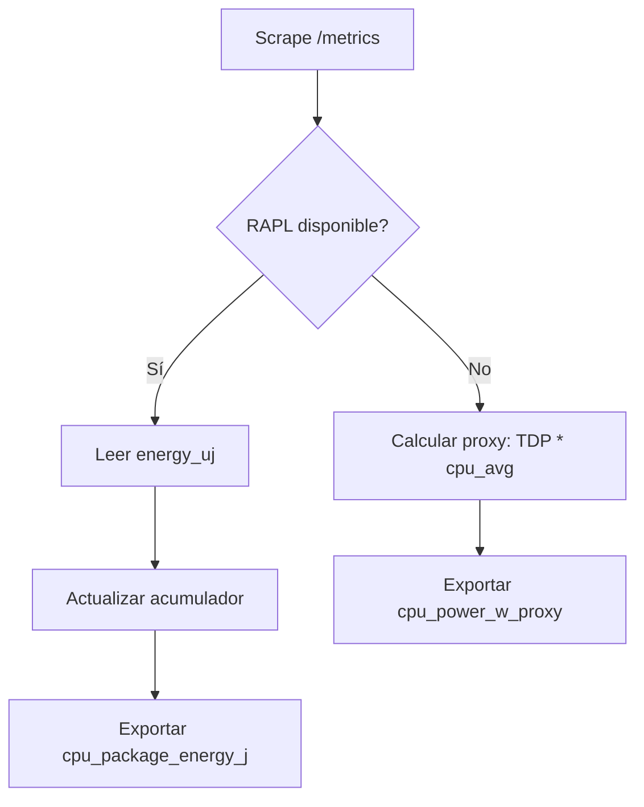

# Plan de Mejora de Medición Energética (RAPL / powercap)

## 1. Objetivo
Integrar medición directa de energía/ potencia del CPU mediante la interfaz Linux powercap (RAPL) y ofrecer métricas confiables que sustituyan o complementen el proxy basado en TDP y uso de CPU.

## 2. Alcance
- Lectura periódica de `energy_uj` y `max_energy_range_uj` para detectar overflow.
- Cálculo de energía acumulada y potencia promedio por intervalo de scrape.
- Normalización por MB procesados y por registro durante etapas TRAIN.
- Fallback automático al proxy si RAPL no está disponible.

## 3. Arquitectura de Instrumentación
| Componente | Función | Archivo | Estado |
|------------|---------|---------|--------|
| Lector RAPL | Lee contador microjoules en `/sys/class/powercap/intel-rapl:*` | `backend/api/main.py` | Parcial (acumulador) |
| Derivador potencia | `(delta_J / delta_t)` para potencia W | `python-analysis/aggregate_metrics.py` (extensión) | Pendiente |
| Exportador Prometheus | Gauges `cpu_package_energy_j`, `cpu_package_power_w` | `backend/api/main.py` | Parcial |
| Enriquecedor CSV | Añade columnas `rapl_energy_j_total` y `rapl_power_w_mean` | `aggregate_metrics.py` | Pendiente |

## 4. Flujo de Datos
1. `uvicorn` sirve la API. En cada `/metrics`:
   - Se llama `update_energy_accumulator()`.
   - Se expone contador acumulado `cpu_package_energy_j`.
2. Scripts de entrenamiento generan filas TRAIN_* con timestamps (extensión recomendada).
3. Post-proceso (`aggregate_metrics.py`) sincroniza energía acumulada con ventanas de entrenamiento (diferencia de contador al inicio/fin).
4. Nuevas columnas se agregan y visualizan en Grafana.

## 5. Detección y Fallback

## 6. Manejo de Overflow
- Leer `max_energy_range_uj` (si existe) para conocer rango máximo.
- Si `current < last_read` y diferencia grande, asumir wrap: `delta = (current + max_range - last_read)`.

## 7. Fórmulas
- `delta_J = energy_j_current - energy_j_previous` (ajustado por wrap).
- `power_w = delta_J / delta_t`.
- `energy_j_per_mb (directo) = delta_J / MB_proc`.
- `energy_j_per_record (directo) = delta_J / n_train`.

## 8. Extensiones de Código (Pendientes)
- Añadir timestamps a filas de entrenamiento (inicio/fin) para calcular ventanas precisas.
- Persistir lecturas RAPL en `data/results/<expId>/monitor/energy_log.csv`.
- Función en `aggregate_metrics.py`: `merge_energy_windows(train_rows, energy_log) -> enriquecidos`.

## 9. Validación
| Prueba | Método | Criterio |
|--------|--------|----------|
| Lectura básica | `cat energy_uj` | Valor > 0 y creciente |
| Overflow | Simular lectura tras varias horas | Contador wrap sin energía negativa |
| Consistencia potencia | Comparar con `powertop` | Diferencia < 15% en promedio |
| Reproducibilidad | Repetir 3 runs idénticos | Varianza energía/MB < 5% |

## 10. Riesgos y Mitigaciones
| Riesgo | Mitigación |
|--------|-----------|
| Falta permisos (contenedor) | Montar `/sys` como read-only y añadir CAP_SYS_ADMIN si necesario |
| Hardware sin RAPL | Fallback proxy sin error |
| Desfase temporal | Registrar timestamps de inicio/fin de etapa |
| Coste de I/O | Cache lectura, máximo 1 por scrape |

## 11. Roadmap Implementación
| Semana | Tarea |
|--------|-------|
| 1 | Lectura robusta RAPL + overflow |
| 2 | Timestamps etapa TRAIN + energy_log.csv |
| 3 | Merge en aggregate + columnas directas |
| 4 | Panel Grafana "Energy (Direct)" comparativo |
| 5 | Validación cuantitativa vs herramientas externas |

## 12. Futuras Extensiones
- Medición GPU (NVML) si se incorporan modelos acelerados.
- Modelado de coste energético por operación (inferencia vs entrenamiento).
- Estimación CO₂ eq. usando factores regionales.

Última actualización: 2025-11-11
