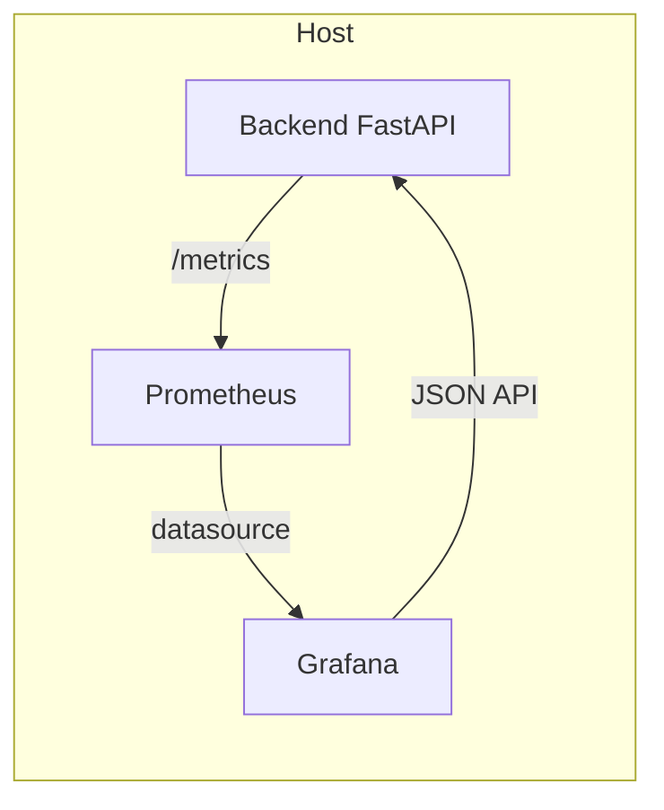

# Guía visual: Monitoreo con Grafana (CPU, RAM, Watts) y modo Live

Esta guía te muestra, de forma visual y con ejemplos, cómo:
- Arrancar la pila Backend + Prometheus + Grafana
- Ver CPU / RAM / Watts en el dashboard
- Ejecutar experimentos (con seed opcional)
- Usar el modo Live en tiempo real
- Solución de problemas común

## Arquitectura (alto nivel)



Notas:
- Prometheus raspa `/metrics` (cada 1s por defecto).
- Grafana se provisiona con el dashboard "SMA Overview"; también consulta el endpoint JSON `/state/api-base` para construir enlaces de control.

## 1) Arrancar la pila

- Terminal (Linux):

```bash
# En la raíz del repositorio
bash scripts/start_stack.sh --build --isolated
# Grafana → http://localhost:3000 (admin/admin)
# Backend (publicado) → ver puerto
cat data/results/_server_state/backend_host_port.txt
```

Si no existe `backend_host_port.txt`, también puedes leer:

```bash
jq -r .port data/results/_server_state/uvicorn_dashboard.json
```

## 2) Abrir el dashboard y ver CPU/RAM/Watts

- Accede a Grafana: http://localhost:3000
- Dashboard: SMA Overview
- Paneles clave:
  - "CPU % (avg last train)": uso medio de CPU del último entrenamiento
  - "Mem Peak MB (last train)": memoria pico (MB)
  - "CPU Power (RAPL vs Proxy)": potencia (W) vía RAPL si está disponible; si no, proxy basado en TDP y %CPU
  - Sección "Live Experiment": watts y records/s en tiempo real

Consejo: Si no ves datos, ejecuta un experimento para poblar las series.

## 3) Ejecutar experimentos con seed (desde el dashboard / API)

- Enlaces rápidos en la sección "Controls" del dashboard (usa la variable `${apiBase}` automáticamente):
  - "Run single (control)"
  - "Run single (treatment)"
  - "Run batch (x5)"
  - "Live start 60s" / "Live stop"

- Desde terminal (reemplaza <PUERTO> por el publicado):

```bash
curl "http://localhost:<PUERTO>/trigger/run-single?group=control&seed=123"
```

Tras el run:

```bash
bash scripts/aggregate_metrics.sh
bash scripts/stats_analysis.sh
```

## 4) Modo Live (tiempo real)

- Iniciar 30s de live:

```bash
curl "http://localhost:<PUERTO>/trigger/live-start?seconds=30"
```

- Parar live:

```bash
curl "http://localhost:<PUERTO>/trigger/live-stop"
```

Mientras Live está activo, los paneles "Live Avg Watts" y "Live Records/s" se actualizan ~cada 1s.

## 5) Problemas comunes y cómo resolver

- "No veo datos en accuracy/F1": ejecuta al menos un experimento para poblar el CSV agregado; el endpoint `/metrics` deriva sus series de `data/results/aggregate_metrics.csv`.
- 
- `${apiBase}` no apunta al puerto correcto:
  - Asegúrate de que `data/results/_server_state/backend_host_port.txt` existe y contiene el puerto publicado.
  - La variable `apiBase` del dashboard usa el datasource JSON "API State" → `/state/api-base`.
- Watts reales (RAPL) no aparecen:
  - Algunas máquinas no exponen RAPL. Verás `cpu_power_w_proxy` (estimación) en su lugar.
- Métricas de CPU/RAM del sistema (host):
  - Opción rápida: usar métricas derivadas de entrenamiento (paneles last train) y el proxy de watts.
  - Opción completa: añadir `node-exporter` (ver docs/como_correr_experimentos.md sección "Métricas del sistema").

## 6) Exportar paneles como imágenes (PNG)

Con el plugin `grafana-image-renderer` instalado (lo incluye la pila), puedes exportar paneles a PNG:

```bash
bash scripts/export_grafana_panels.sh
```

Parámetros útiles (variables env):
- GRAFANA_URL (default http://localhost:3000)
- FROM / TO (default now-1h / now)
- WIDTH / HEIGHT (dimensiones)

Las imágenes se guardan en `docs/figures/`.

## 6) Atajos útiles

- Salud del backend:
```bash
curl http://localhost:<PUERTO>/health
```

- Estado Live (debug):
```bash
curl http://localhost:<PUERTO>/live/state | jq
```

- API base sugerida:
```bash
curl http://localhost:<PUERTO>/state/api-base | jq
```
