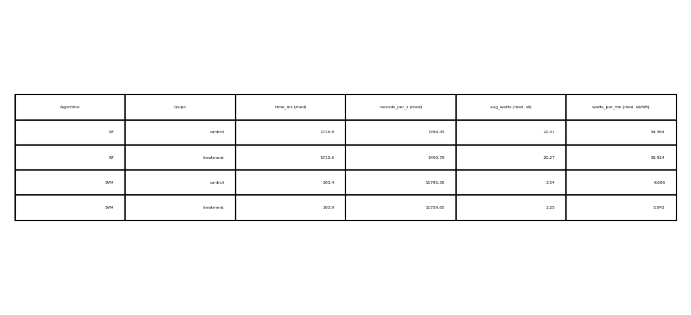

# Trabajo de Grado (Pregrado)

## Eficiencia y Sostenibilidad Computacional de Algoritmos de Machine Learning para la clasificación supervisada en Analítica de Datos: Un Enfoque Multiagente

Eficiencia energética (Watts/W·MB) y resiliencia en pipelines de aprendizaje automático (control vs. SMA)

—

- Autor: Santiago Mazo Orozco
- Programa: Administración de Sistemas Informáticos (Pregrado)
- Universidad: Universidad Nacional de Colombia
- Director: Néstor Darío Duque M.
- Fecha: 12 de noviembre de 2025

—

### Mensaje clave (elevator pitch)
- Este trabajo compara un enfoque tradicional (control) vs. un enfoque multiagente (SMA) en términos de consumo de recursos y potencia: Watts promedio (W) y W por MB procesado (W/MB).
- Integra orquestación/monitoring con métricas reproducibles y figuras generadas automáticamente desde `aggregate_metrics.csv`.
- Resultados listos para decisión: impacto en eficiencia, productividad y resiliencia del pipeline.

—

### Visual de portada (opcional)
Inserta una figura resumen para dar contexto desde el inicio (baja opacidad si es fondo):

> Alternativa control-only si no se presentan corridas SMA: `../../figures/control_only/summary_table_metrics.png`.

—

### Detalles prácticos (para el jurado)
- Repositorio/artefactos: [QR aquí] → `your-org/your-repo` (ajusta a URL real)
- Reproducibilidad: scripts `scripts/run_experiment.sh`, `scripts/aggregate_metrics.sh`, y generación de figuras `python-analysis/generate_thesis_figures.py`.
- Métricas energéticas "watts-first": `avg_watts`, `watts_per_mb`, `watts_per_record`.

—

> Coloca los logos institucionales en las esquinas inferiores o superiores (PNG/SVG en `docs/figures/` o `docs/presentations/assets/`).
