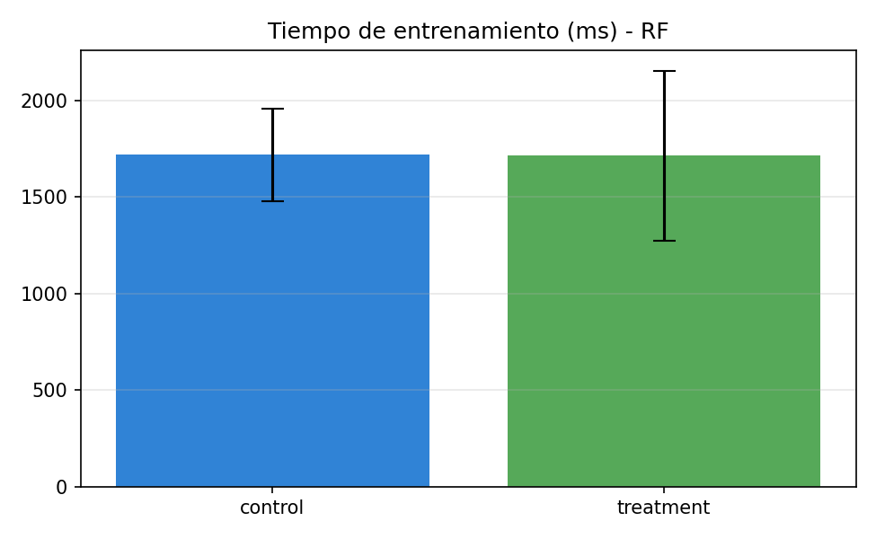
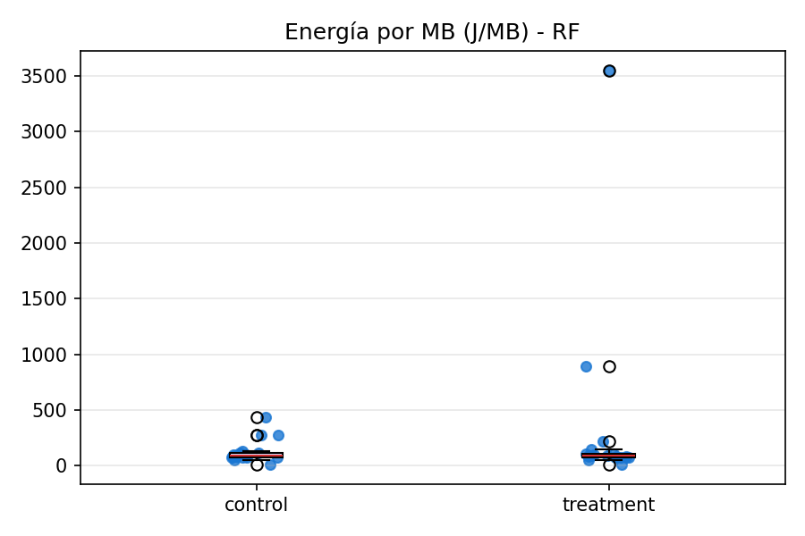

# 7) Resultados — Random Forest (5:45–6:45)

- Hallazgo clave: bajo la carga actual no se observaron diferencias significativas entre control y SMA (p ≥ 0.05) en las métricas principales.
- Enfoque: comparar tiempo de entrenamiento y energía normalizada.

Tiempo de entrenamiento (ms)

Energía normalizada (J/MB)

Notas
- Barras con IC95% y distribución ordenada por mediana (cuando aplica).
- Resultados reproducibles desde `data/results/aggregate_metrics.csv` y `data/results/stats_summary.{md,json}`.
- Variante watts-first disponible (W/MB): `../../figures/train_watts_per_mb_rf.png`.
